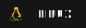

## Hey!

 

My name is Teryn, but you can call me T! I am an FOSS enthusiast and wannabe sys admin.
I am moving away from GitHub and into . So there won't be much to see here!

### If you are curious about me:

- 💼 Full Stack Web Developer at Dinify.
- 🖼 My profile picture was drawn by a friend and is a mix of me and the Magic The Gathering's character Teysa Karlov.

 

 

### Languages & Markups

 

### Technologies

  <!-- Can we bury redux once and for all, please & thank you -->

 

### Tools

  <!-- sashay away postman -->

  <!-- I use arch btw -->

  
LeetCode

 
  

  
   
  

<!-- Credits

Badges - shields.io - https://img.shields.io/badge/<NAME>-informational?style=for-the-badge&logo=<NAME>&color=151515
Icons - simpleicons - https://simpleicons.org/
https://img.shields.io/badge/.env-informational?style=for-the-badge&logo=.env&color=151515
 -->
