## Hey!

My name is Teryn, but you can call me T! I'm a web developer. I am currently having a blast contributing with Open Source!

### Languages & Markups

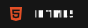

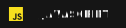
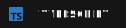

 

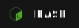

 

### Technologies

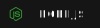
 
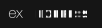
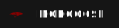
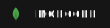

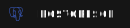

 

### Tools

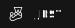

 

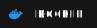

 

  
LeetCode

 
  

  
   
  

<!-- Credits

Badges - shields.io - https://img.shields.io/badge/<NAME>-informational?style=for-the-badge&logo=<NAME>&color=151515
Icons - simpleicons - https://simpleicons.org/
https://img.shields.io/badge/.env-informational?style=for-the-badge&logo=.env&color=151515
 -->
